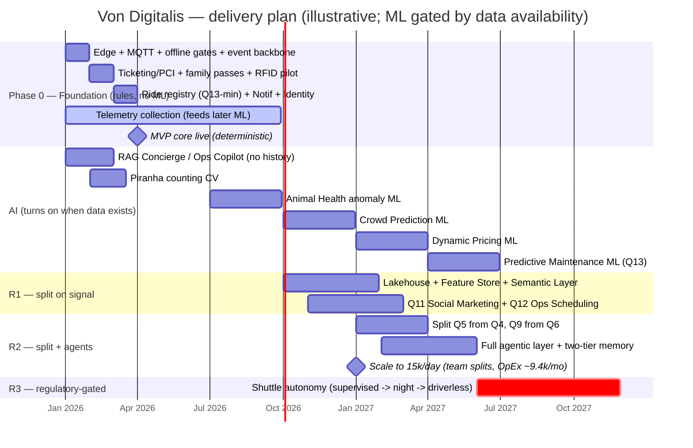

# Implementation plan (phased, cold-start-aware)

One rule anchors the timeline: **sensors buy in a week, a year of data buys for nothing.** So each AI capability is scheduled by *when its data exists*, not by ambition — until then it runs its deterministic fallback (see [ADR-009](../04-adrs/ADR-009-rules-to-ai-cold-start.md)). Dates are illustrative (assumption).

## Delivery timeline (Gantt)

Month 0 = project start (illustrative anchor). ML bars begin at the **earliest** date their data exists (cold-start table below); each is promoted only when it beats its rule-fallback on the golden set.

## Phase 0 — Foundation (months 0–3), no ML yet
Edge (MQTT store-and-forward, gate offline-cache), event backbone, Ticketing/PCI (Q1/Q2), Identity (Q8), **anonymous footfall counting (Q3, rules only)**, Notifications (Q7), Ride registry + rule-based inspections (Q13-min), AI Gateway (basic), **manned electric land-train (Q10 asset) leased + data-mule collector on board**. Everything runs on deterministic rules; **data collection starts** so models have something to learn from later.

## Cold-start arithmetic — when each AI capability can turn on
| Capability | Needs before ML | Earliest ML |
|---|---|---|
| RAG Concierge / Ops Copilot | knowledge base (no history needed) | **month 1** |
| Piranha counting (CV) | labeled underwater footage (weeks) | **month 2–3** |
| Animal Health anomaly | per-animal baselines (~2–3 mo telemetry) | **month 6–9** |
| Crowd Prediction | seasonal footfall history | **month 9–12** |
| Dynamic Pricing | demand-elasticity history | **month 12–15** |
| Predictive Maintenance (Q13) | ride-cycle + failure history | **month 15+** |

Until its threshold, a capability runs its **deterministic fallback** (rules/static), and the model is promoted **only when it beats that fallback** on the golden set (see [validation & verification](../05-ai/validation-verification.md)).

## Split-by-signal roadmap (R1–R3)
- **R1** — Social Marketing (Q11), Operations & Scheduling (Q12), Lakehouse + Feature Store + Semantic Layer.
- **R2** — split Q5 from Q4 and Q9 from Q6, **full agent layer** (Animal/Management + two-tier memory), predictive-maintenance ML (Q13).
- **R3** — shuttle **autonomy** (autopilot/driverless) after supervised-driving statistics, budget, and regulatory clearance (the manned electric transport + data-mule already ship in the MVP).
Signals and rationale — [MVP vs roadmap](../02-solution/mvp-vs-roadmap.md).

## First 90 days (concrete)
- **Weeks 1–4:** edge nodes + MQTT + offline gates; footfall counters; event backbone.
- **Weeks 5–8:** Ticketing/PCI + family passes; anonymous zone analytics + dashboards; RFID token pilot.
- **Weeks 9–12:** AI Gateway + **RAG assistant live (day-one AI value, no history needed)**; start animal telemetry to build baselines for month-6 welfare ML.

**Result:** real value from week 1 (offline ticketing, live footfall, RAG assistant), while heavier ML lands exactly when its data is ready — no model shipped before it can beat a rule.
