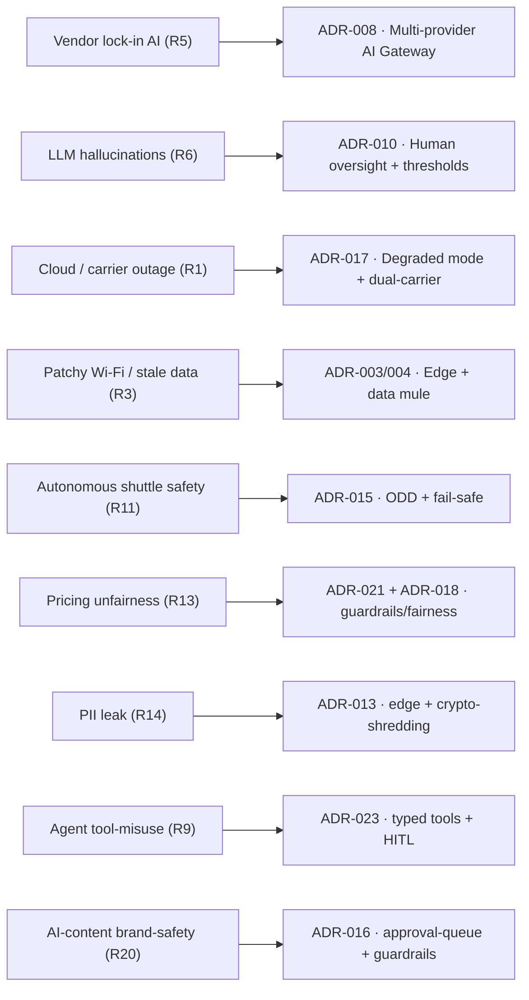

# Risk Register (RAID)

A consolidated list of risks, aggregated from ADRs and perspectives: **risk → likelihood → impact → mitigation → owner → related ADR**. Detailed trade-offs are in the ADRs themselves (Consequences sections). L/I: L=low, M=med, H=high.

## Risk → ADR map (key)

Two-way traceability: the register gives Risk→ADR (tables below), and each ADR in the Traceability section states **"Mitigates risks: R#"** (ADR→Risk).

## Technical / connectivity / edge
| # | Risk | L | I | Mitigation | Owner | ADR |
|---|---|---|---|---|---|---|
| R1 | Full cloud outage / mobile carrier failure | M | H | dual-carrier + satellite; local safety alerts without the cloud; offline sales mode; degradation matrix | Platform/SRE | [017](../04-adrs/ADR-017-connectivity-failure-degraded-operation.md) |
| R2 | Loss/duplication of events under at-least-once | M | M | Inbox/Outbox + idempotency by event id + partition key | Platform | [007](../04-adrs/ADR-007-event-reliability-inbox-outbox.md) |
| R3 | Stale data at the edge (patchy Wi-Fi) | H | M | store-and-forward, data mule, local cache; classification real-time vs delay-tolerant | Edge/IoT | [003](../04-adrs/ADR-003-edge-mqtt-store-and-forward.md), [004](../04-adrs/ADR-004-edge-connectivity-mesh-cellular-data-mule.md) |
| R4 | **CDC desync lakehouse ↔ operational SoT; training/serving skew** | M | M | dataset owners, feature-store freshness control, skew monitoring | Data | [022](../04-adrs/ADR-022-lakehouse-and-feature-store.md) |
| R21 | **Radio-bridge degradation** (loss of LoS from construction/vegetation growth, weather, bridge failure, misaligned aim) | M | M | site survey (LoS+Fresnel+margin for growth/construction), redundancy/mesh for critical links, local buffering at the edge, fiber for critical zones, re-alignment procedure | Edge/IoT | [004](../04-adrs/ADR-004-edge-connectivity-mesh-cellular-data-mule.md) |

## AI / models / agents
| # | Risk | L | I | Mitigation | Owner | ADR |
|---|---|---|---|---|---|---|
| R5 | AI provider change/price increase/shutdown | M | H | provider abstraction + fallback + cost-monitor (AI Gateway) | AI Platform | [008](../04-adrs/ADR-008-ai-platform-provider-abstraction-fallback-cost.md) |
| R6 | GenAI hallucinations/non-determinism | H | M | grounding+citations (RAG), guardrails, eval/fitness, human-in-the-loop, shadow-mode | AI Platform | [010](../04-adrs/ADR-010-human-in-the-loop-confidence-thresholds.md), [018](../04-adrs/ADR-018-ai-governance-framework.md), [019](../04-adrs/ADR-019-rag-knowledge-assistant.md) |
| R7 | Model drift in production | M | M | drift monitoring (PSI), thresholds, retraining, "rules→AI" as fallback | AI Platform | [009](../04-adrs/ADR-009-rules-to-ai-cold-start.md), [018](../04-adrs/ADR-018-ai-governance-framework.md) |
| R8 | **Agent memory poisoning** (erroneous outcomes are written to memory → degradation) | M | M | memory-write validation, TTL, human-approved outcomes for the critical, rollback | AI Platform | [024](../04-adrs/ADR-024-lakehouse-as-agent-memory.md) |
| R9 | Tool-misuse / prompt-injection in agents | M | H | typed least-privilege tools, human-approval of actions, PI filters, audit | AI Platform | [023](../04-adrs/ADR-023-agentic-layer.md) |
| R10 | **Crowd Prediction error cascade** → wrong prices (Q1/ADR-021) and rostering (Q12) | M | M | forecast smoothing, confidence thresholds, human-review of schedules/prices | AI Platform | [020](../04-adrs/ADR-020-crowd-prediction-ai.md) |

## Safety / ethics / governance
| # | Risk | L | I | Mitigation | Owner | ADR |
|---|---|---|---|---|---|---|
| R11 | Autonomous shuttle incident (children, venomous animals nearby) | L | H | ODD, low-speed, fail-safe to stop, teleoperation, supervised→driverless | Ops/Safety | [015](../04-adrs/ADR-015-autonomous-shuttle-and-data-mule.md) |
| R12 | False-negative safety inspection of an 18th-century ride | L | H | registry + mandatory inspections, conservative predictive-maintenance thresholds, a human approves | Ride Ops | [025](../04-adrs/ADR-025-ride-attractions-management.md) |
| R13 | **Dynamic Pricing: unfairness / proxy discrimination / regulatory** | M | M | price by time/load (not by identity), min/max corridors, family-pass protection, transparency, fairness audit, human-approved policy | Management | [021](../04-adrs/ADR-021-dynamic-pricing-ai.md), [018](../04-adrs/ADR-018-ai-governance-framework.md) |
| R14 | PII leak (video/medical data/telemetry) | M | H | edge inference (not raw video), pseudonymous ticket_id, crypto-shredding, PII-redaction at AIP egress | Security | [013](../04-adrs/ADR-013-privacy-surveillance-and-mobile-telemetry.md) |
| R15 | Card theft / PCI | L | H | external PSP, we do not store cards, PCI scope down to the token | Security | [006](../04-adrs/ADR-006-pci-ticketing-isolation-external-psp.md) |
| R16 | **Keeper alert-fatigue** (many welfare alerts → missing an important one) | M | M | confidence thresholds (3 zones), prioritization, only the critical is escalated to a human | Animal Ops | [010](../04-adrs/ADR-010-human-in-the-loop-confidence-thresholds.md) |
| R20 | **AI-content brand-safety (Q11):** an inappropriate / off-brand AI post reaches the public (venomous animals, children, sensitive topics) | M | H | approval queue (a human publishes), brand-voice templates, guardrails/moderation, auto-publish only low-risk formats with post-moderation | Marketing/Management | [016](../04-adrs/ADR-016-ai-marketing-and-scheduling-hitl-provider-abstraction.md), [018](../04-adrs/ADR-018-ai-governance-framework.md) |

## Business / suppliers
| # | Risk | L | I | Mitigation | Owner | ADR |
|---|---|---|---|---|---|---|
| R17 | **Dependence on a single PSP** | L | M | payment abstraction; option of a second PSP as it grows | Management | [006](../04-adrs/ADR-006-pci-ticketing-isolation-external-psp.md) |
| R18 | Budget risk (estate unprofitable) | M | H | realistic SLA 3–4 nines, serverless scale-to-zero, build-vs-buy, monthly cost control | Management | [cost.md](cost.md) |
| R19 | Vendor lock-in of the autonomous platform (physical) | M | M | certified vendor + integration migration plan; deferred to roadmap R3 | Ops | [015](../04-adrs/ADR-015-autonomous-shuttle-and-data-mule.md) |

## Owners (roles)
Platform/SRE · Data · AI Platform · Security · Ops/Safety · Ride Ops · Animal Ops · Management. Each risk is led by an owner; status is reviewed at iterations.

> The register aggregates risks; exhaustive trade-offs and rejected alternatives are in the corresponding ADRs.
