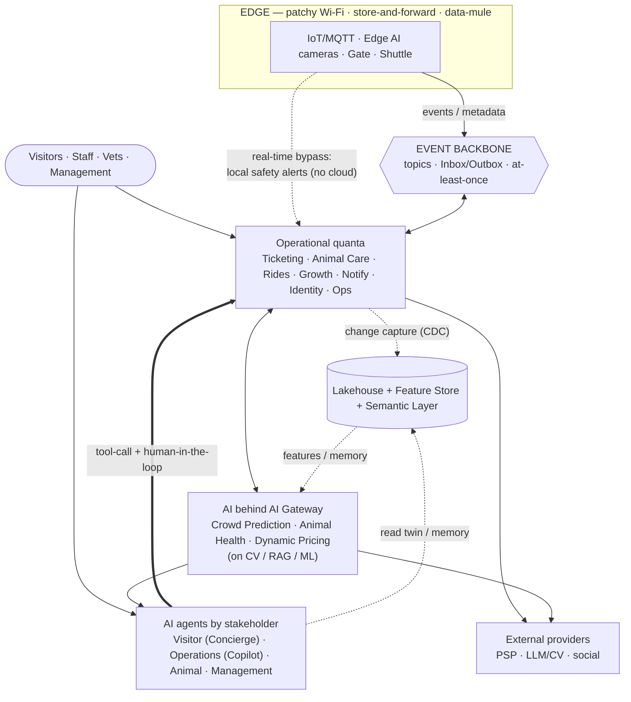

# Von Digitalis Estates — Architectural Kata 2026 (AI-Assisted)

A modern AI architecture for the estate of the 72nd Countess von Digitalis: tickets, popularity analytics, animal monitoring, growth and profitability — with a focus on applying AI.

> **In one phrase:** an event-driven architecture of architectural quanta + an edge layer for patchy Wi-Fi/MQTT + an end-to-end AI platform (provider abstraction, human-in-the-loop, V&V), where AI is embedded into business processes through stakeholder agents.

## Solution at a glance

**Legend — lines:** solid → main data flow / call · dashed → inference, change-capture (CDC), memory, or real-time bypass · **bold** → agent action via a typed tool (human-in-the-loop). **Shapes:** rounded = people (actors) · cylinder = data store · hexagon = event bus.

*Not a linear pipeline: the bus is the central hub (bidirectional exchange), critical data bypasses the cloud (edge-bypass), agents act back into the quanta through typed tools. The data platform (Lakehouse + Feature Store + Semantic Layer) doubles as the park's "digital twin" — domain projections, not a separate system. More detail — [layered view](diagrams/layered-reference.md).*

**5 core AI capabilities (the brief's pain points):** Visitor Concierge · Animal Health AI · Crowd Prediction · Dynamic Pricing · Operations Copilot.
**+ additional AI use cases:** AI social marketing (highlight-mining) · AI schedules (constraint-opt) · monetization of carnivorous plants (feeding-show CV) · autonomous shuttle + data-mule · feedback sentiment.
**AI directly helps 4 groups:** visitors · staff · veterinarians · management.
**Focus:** MVP — 7 business capabilities (uniting 10 of 13 quanta: Ticketing&Access, Animal Monitoring&Health, Visitor Experience, Analytics, Ride&Attractions, Notifications, Identity) + AIP; Q11–Q12 and Q10 **autonomy** — roadmap (manned electric transport + data-mule ship in the MVP; see [MVP vs roadmap](02-solution/mvp-vs-roadmap.md)).

## How to read (a 5-minute path)
1. **[00-overview](00-overview.md)** — the Countess's problems and how AI solves them (1 screen).
2. **[Solution](02-solution/domain-map.md)** — domain map + [style (worksheet)](02-solution/architecture-style.md) + [MVP vs roadmap](02-solution/mvp-vs-roadmap.md).
3. **[Key ADRs](#key-architectural-decisions)** — 10 key decisions (below); the full set — [index](04-adrs/README.md).
4. **[AI](05-ai/ai-overview.md)** — [agents](05-ai/agents.md), [uncertainty](05-ai/uncertainty.md), [V&V](05-ai/validation-verification.md), [governance](05-ai/governance.md).
5. **[Diagrams](diagrams/README.md)** — C4, deployment, data-flow (data movement).
6. Depth: [views](#table-of-contents) (deployment/reliability/security/data/cost/operational/**risk-register**) · [glossary](glossary.md).

## Master traceability (goal → capability → quantum → key ADR → risk → fitness)

Closed loop — from a brief goal all the way to how we verify it (fitness function / V&V).

| Brief goal | Capability | Quantum | Key ADR | Risk | Fitness / V&V |
|---|---|---|---|---|---|
| Tickets + family passes | Ticketing/Access | Q1/Q2 | [006](04-adrs/ADR-006-pci-ticketing-isolation-external-psp.md) | R15 | PCI scope = SAQ-A; 0 double-charges (idempotency); offline validation success |
| Understand zone popularity | Analytics + Crowd Prediction | Q3 | [020](04-adrs/ADR-020-crowd-prediction-ai.md) | R10 | queue/forecast error ≤ 15%; drift PSI < 0.2 |
| Animal health/feeding | Animal Health AI | Q5 | [010](04-adrs/ADR-010-human-in-the-loop-confidence-thresholds.md) | R16 | welfare recall ≥ 0.95; F1 ≥ 0.90; alert→keeper ≤ 30 s |
| Growth and visitor return | Growth / Visitor Concierge | Q6 | [023](04-adrs/ADR-023-agentic-layer.md) | R9 | quest completion ≥ 30%; agent task-success / override-rate |
| Profitability | Dynamic Pricing / AI Marketing | Q1/Q11 | [021](04-adrs/ADR-021-dynamic-pricing-ai.md) | R13 | revenue/utilization vs complaints; fairness audit; brand-safety (R20) |
| patchy Wi-Fi + data to cloud | Edge + data-mule | Q2/Q4/Q10 | [004](04-adrs/ADR-004-edge-connectivity-mesh-cellular-data-mule.md) | R1/R3 | degraded-mode drill; 0 data loss (at-least-once + idempotent) |
| AI uncertainty | AI Gateway (multi-provider) | AIP | [008](04-adrs/ADR-008-ai-platform-provider-abstraction-fallback-cost.md) | R5 | per-provider eval-gate; cost-per-request; switching policy |
| AI validation/verification | Governance + HITL | AIP | [018](04-adrs/ADR-018-ai-governance-framework.md) | R6 | eval-harness + calibration; incident MTTD; audit trail |

*Full bidirectional Risk↔ADR traceability — in the [risk-register](03-views-and-perspectives/risk-register.md). Per-capability fitness thresholds — in [validation & verification](05-ai/validation-verification.md).*

## Key qualities of the solution → where covered

| Quality / requirement | Where covered |
|---|---|
| **Innovative use of AI** | AI portfolio (5 core + additional): [ai-overview](05-ai/ai-overview.md) · Crowd Prediction [020](04-adrs/ADR-020-crowd-prediction-ai.md) · Dynamic Pricing [021](04-adrs/ADR-021-dynamic-pricing-ai.md) · agentic layer [023](04-adrs/ADR-023-agentic-layer.md) |
| **Suitability under constraints** | edge + data-mule [004](04-adrs/ADR-004-edge-connectivity-mesh-cellular-data-mule.md) · [MVP vs roadmap](02-solution/mvp-vs-roadmap.md) · [cost (growth scenarios)](03-views-and-perspectives/cost.md) |
| **Appropriate level of detail** | ADRs with trade-offs ([index](04-adrs/README.md)) · C4 [context](diagrams/c4-context.md)/[container](diagrams/c4-container.md) · [views](03-views-and-perspectives/deployment.md) |
| **Dealing with uncertainty in AI** | AI Gateway (multi-provider/fallback) [008](04-adrs/ADR-008-ai-platform-provider-abstraction-fallback-cost.md) · [uncertainty](05-ai/uncertainty.md) |
| **Alignment of AI characteristics with the architecture** | quanta by driving characteristics [001](04-adrs/ADR-001-event-driven-architecture-and-quanta.md)/[002](04-adrs/ADR-002-quantum-boundaries-by-characteristics.md) · [architecture-style (worksheet)](02-solution/architecture-style.md) · AI behind AIP in its own quanta |
| **Validation & verification of AI** | HITL + thresholds [010](04-adrs/ADR-010-human-in-the-loop-confidence-thresholds.md) · governance [018](04-adrs/ADR-018-ai-governance-framework.md) · [validation & verification](05-ai/validation-verification.md) |

## Key Architectural Decisions

10 key decisions (the full set — **26 ADRs**; ADR-012 merged into ADR-011; index: [04-adrs/](04-adrs/README.md)):

| # | Decision | Answers |
|---|---|---|
| [ADR-001](04-adrs/ADR-001-event-driven-architecture-and-quanta.md) | Event-driven backbone + architectural quanta | style for heterogeneous characteristics (the "characteristics alignment" criterion) |
| [ADR-004](04-adrs/ADR-004-edge-connectivity-mesh-cellular-data-mule.md) | Connectivity: mesh / cellular / **data-mule** (threshold by area) | patchy Wi-Fi + data delivery to the cloud (suitability), differentiator |
| [ADR-008](04-adrs/ADR-008-ai-platform-provider-abstraction-fallback-cost.md) | **AI Gateway** (multi-provider router, fallback, cost) | uncertainty in AI |
| [ADR-010](04-adrs/ADR-010-human-in-the-loop-confidence-thresholds.md) | Human-in-the-loop + confidence thresholds | validation & verification of AI |
| [ADR-018](04-adrs/ADR-018-ai-governance-framework.md) | **AI Governance** (risk classification + controls) | AI manageability: risk classes, bias/fairness, compliance |
| [ADR-019](04-adrs/ADR-019-rag-knowledge-assistant.md) | **RAG assistants** (grounding + citations) | Visitor Concierge + Operations Copilot; fighting hallucinations |
| [ADR-020](04-adrs/ADR-020-crowd-prediction-ai.md) | **Crowd Prediction** (forecasting queues/crowds ahead) | innovative AI + "where to deploy staff" |
| [ADR-021](04-adrs/ADR-021-dynamic-pricing-ai.md) | **Dynamic Pricing** (demand/load, within corridors) | innovative AI + profitability (the brief's goal) |
| [ADR-022](04-adrs/ADR-022-lakehouse-and-feature-store.md) | **Lakehouse + Feature Store** on top of database-per-quantum | a unified data/ML platform |
| [ADR-023](04-adrs/ADR-023-agentic-layer.md) | **Agentic layer** (agents by stakeholder) | AI embedded into business processes |

> The remaining ADRs (edge MQTT store-and-forward, "rules→AI" cold-start, autonomous shuttle, cameras, privacy, PCI, CQRS, reliability, transport, attractions, RFID, etc.) — depth of elaboration; see the [ADR index](04-adrs/README.md).

## Quanta ↔ business capabilities

Capabilities are primary, quantum numbers are secondary (expand the map of 13 quanta)

| Quantum | Capability | | Quantum | Capability |
|---|---|---|---|---|
| Q1 | Ticketing & Payments | | Q8 | Identity & Profile |
| Q2 | Access & Gate | | Q9 | Feedback & Sentiment |
| Q3 | Visitor Movement & Analytics | | Q10 | Internal Transport & Mobility |
| Q4 | Animal IoT Monitoring | | Q11 | AI Social Marketing |
| Q5 | Animal Health & AI | | Q12 | Operations & Scheduling |
| Q6 | Growth & Route-Quest | | Q13 | Ride & Attractions Mgmt |
| Q7 | Notifications | | AIP | AI Platform / Gateway (cross-cutting) |

## Table of contents

Full map of the submission's files (expand)

- [Overview](00-overview.md) · [Glossary](glossary.md) · [How we used AI](how-we-used-ai.md) · [Decision log & negative space](decision-log.md)
- Problem: [brief facts](01-problem/brief-facts.md) · [stakeholders](01-problem/stakeholders.md) · [requirements](01-problem/requirements.md) · [constraints & assumptions](01-problem/constraints-assumptions.md)
- Solution: [architecture style](02-solution/architecture-style.md) · [domain map](02-solution/domain-map.md) · [MVP vs roadmap](02-solution/mvp-vs-roadmap.md)
- Views: [deployment](03-views-and-perspectives/deployment.md) · [reliability](03-views-and-perspectives/reliability.md) · [security & privacy](03-views-and-perspectives/security-privacy.md) · [data](03-views-and-perspectives/data.md) · [cost](03-views-and-perspectives/cost.md) · [operational & team](03-views-and-perspectives/operational.md) · [implementation plan](03-views-and-perspectives/implementation-plan.md) · [risk register (RAID)](03-views-and-perspectives/risk-register.md)
- [ADRs index](04-adrs/README.md) · AI: [overview](05-ai/ai-overview.md) · [agents](05-ai/agents.md) · [uncertainty](05-ai/uncertainty.md) · [validation & verification](05-ai/validation-verification.md) · [governance](05-ai/governance.md)
- Diagrams: [structure](diagrams/README.md) — [layered view](diagrams/layered-reference.md) · [C4 context](diagrams/c4-context.md) · [C4 container](diagrams/c4-container.md) · [deployment](diagrams/deployment.md) · [AI Gateway](diagrams/ai-gateway.md)
- Data-flow: [sensor→decision](diagrams/flow-sensor-to-decision.md) · [data-mule](diagrams/flow-data-mule.md) · [data→forecast→action](diagrams/flow-data-to-decision.md) · [data lifecycle](diagrams/flow-data-lifecycle.md)

## Team
**BONK**

---
*Fact/assumption legend: the brief's facts — in `01-problem/brief-facts.md` (SSOT). Everything marked "(assumption)" is our design assumption.*
