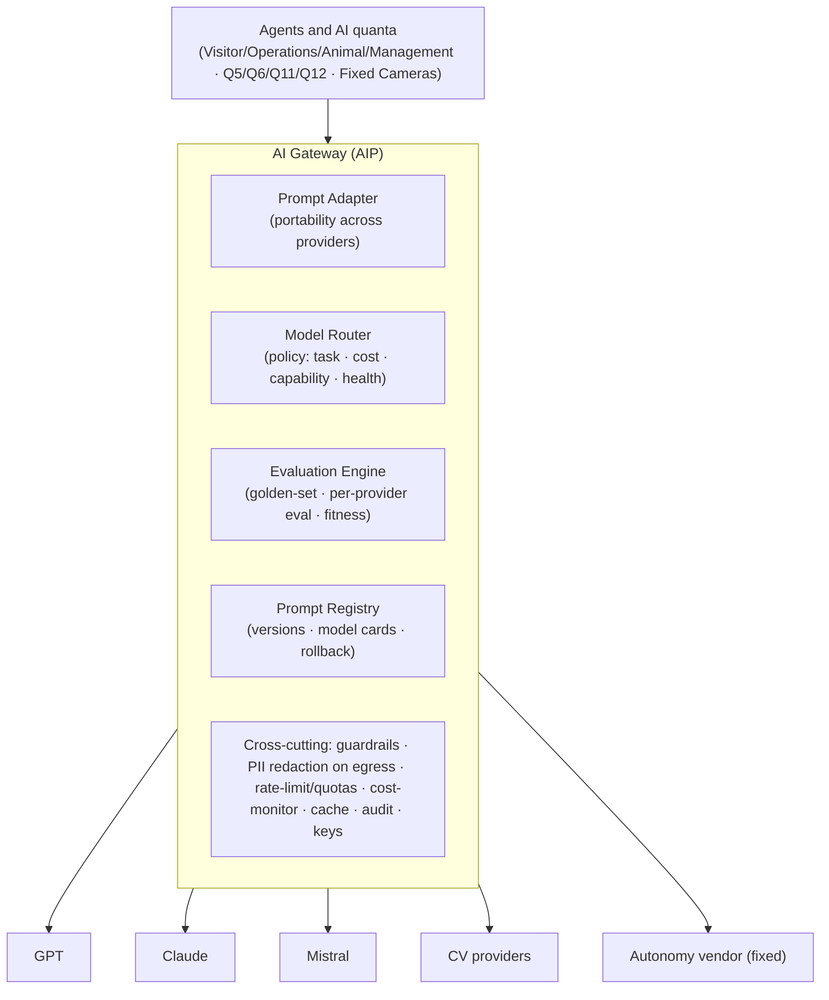

# AI Gateway (AIP) — internal design

**What it shows:** the internal design of the single AI gateway (AIP), through which all AI calls from agents and quanta go to the pool of providers.

All AI calls from agents and quanta go through the **AI Gateway (AIP)** to the pool of providers. The decision — [ADR-008](../04-adrs/ADR-008-ai-platform-provider-abstraction-fallback-cost.md).

## Legend

- **The GW block** — the single AI Gateway (AIP): all calls pass through it, keys and control live only here.
- **Internal blocks** (Prompt Adapter, Model Router, Evaluation Engine, Prompt Registry, cross-cutting) — the gateway's functional components.
- **Arrows** — direction of an AI call: agents/quanta → GW → the specific provider (GPT/Claude/Mistral/CV/autonomy).

## Components
| Component | Purpose | Phase |
|---|---|---|
| **Prompt Adapter** | adapts the prompt/format to the specific provider (GPT/Claude/Mistral react differently) | **MVP** |
| **Evaluation Engine** | offline golden-set in CI + online thresholds, **per-provider eval**, quality/drift fitness functions | **MVP** |
| **Model Router** | policy-based selection from the pool: by task/complexity, cost, capabilities, **health/latency** | MVP (basic) → data-driven in roadmap |
| **Prompt Registry** | prompt/template versions, model cards, rollback | MVP — lightweight versioning; **full Registry — roadmap** |
| **Cross-cutting** | provider abstraction + fallback · guardrails/anti-prompt-injection · **PII redaction on egress** · rate-limit/quotas · cost-monitor + cache · **audit of every call** · keys (only in the AIP) | **MVP** |
| **A/B testing · Experiment Tracking** | experiments over models/prompts | **roadmap** (as scenarios grow) |

> **Phasing (ADR-008):** Prompt Adapter + Evaluation Engine — **from the very start** (they reduce vendor lock-in and quality degradation). Full AI Governance / experiment platform (A/B, full Prompt Registry, Experiment Tracking) — **roadmap** as load/number of AI scenarios grows.

## Principles
- **Multi-provider, not "one + spare":** the router distributes across the pool and switches by health/cost/capabilities.
- **Single point of control:** guardrails, PII redaction, audit, keys — at the gateway, independent of the provider.
- **Safety-critical exception:** the autonomous shuttle — a fixed certified vendor, without on-the-fly arbitration.
