# C4 L2 — Containers (quanta, event backbone, edge, AIP, data & agent platform)

**What it shows:** the internal decomposition of the platform into 13 business quanta, the cross-cutting AIP, the **data platform (Lakehouse+Feature Store+Semantic Layer)**, and the **agent layer**, linked via the event backbone, with an edge layer and clients/BFF.

The internal decomposition of the platform into **13 business quanta (Q1–Q13)** + the cross-cutting **AIP** + the **data platform** (shared memory/analytics) + the **AI Agent Platform** (agents by stakeholder), linked via the **event backbone**, with an **edge layer** (devices under patchy Wi-Fi) below and clients/BFF above. Each quantum is an independent deployment with its own DB; synchronous REST is only front↔BFF, everything else — via the event bus. The data platform and the agent layer are **roadmap phases (R1–R2)**, as are the Q10/Q11/Q12 quanta.

```mermaid
flowchart TB
    %% ==== CLIENTS ====
    subgraph CLIENTS["CLIENTS"]
        direction LR
        pwa["Visitor PWA<br/>route-quest · tickets · surveys"]:::client
        web["Web"]:::client
        adminui["Countess / Admin<br/>(NL analytics)"]:::client
        boards["Info-boards<br/>(shuttle / zones / lost child)"]:::client
        staff["Staff Portal<br/>(staff / veterinarians / management)"]:::client
    end
    bff{{"BFF / API Gateway"}}:::gw
    CLIENTS --> bff

    %% ==== CLOUD BUSINESS QUANTA ====
    subgraph CLOUD["CLOUD — business quanta"]
        direction LR
        q1["Q1 Ticketing &amp; Payments<br/>Security · Consistency (PCI)"]:::q
        q6["Q6 Growth / Route-Quest<br/>optimization · AI quests"]:::q
        q8["Q8 Identity<br/>(buy: external IdP)"]:::q
        q9["Q9 Feedback &amp; Sentiment"]:::q
        q11["Q11 AI Social Marketing<br/>highlight-mining · generation"]:::q
        q12["Q12 Operations &amp; Scheduling<br/>rostering · feeding · maintenance (batch)"]:::q
        q3["Q3 Movement &amp; Analytics<br/>heatmap · queues (CQRS read-side)"]:::q
        q5["Q5 Animal Health &amp; AI<br/>CV · thermal · anomalies"]:::q
        q7["Q7 Notifications<br/>pushes · alerts · announcements"]:::q
        q13["Q13 Ride &amp; Attractions<br/>status · capacity · safety inspections · maintenance"]:::q
    end

    %% ==== EVENT BACKBONE ====
    backbone[["EVENT BACKBONE — topics / streams (compacted)<br/>at-least-once + idempotency · inbox/outbox"]]:::bus

    %% ==== DATA & AGENT PLATFORM (roadmap R1–R2) ====
    subgraph INTEL["DATA &amp; AGENT PLATFORM (roadmap R1–R2)"]
        direction LR
        lake[("Data Platform<br/>Lakehouse medallion · Feature Store · Semantic Layer<br/>CDC from the bus · features · lineage · business metrics")]:::data
        kb[("Vector KB / working memory<br/>RAG context · session/state")]:::data
        agents["AI Agent Platform<br/>Visitor · Operations · Animal · Management<br/>least-privilege tools · HITL"]:::agent
    end

    %% ==== EDGE LAYER ====
    subgraph EDGE["EDGE LAYER — estate, patchy Wi-Fi (only events/metadata go outward)"]
        direction LR
        q2["Q2 Gate scanners<br/>offline-cache of valid tickets"]:::edge
        q4["Q4 IoT MQTT<br/>store &amp; forward buffer"]:::edge
        cams["Edge AI Platform (RGB/Thermal cameras)<br/>Camera Processing · Animal Detection ·<br/>Crowd Analytics · Queue Monitoring · Local Buffering<br/>→ events (NOT raw video)"]:::sensor
        q10["Q10 Shuttle (mobile edge)<br/>autonomy · data mule · WiFi-mesh · 360 · display"]:::edge
    end

    %% ==== AIP ====
    aip["AIP — AI Platform (cross-cutting)<br/>provider abstraction · guardrails · eval/fitness · cost-monitor · fallback"]:::aip
    providers["LLM / CV / autonomy providers"]:::ext
    psp["PSP"]:::ext
    idp["IdP"]:::ext
    social["Social networks"]:::ext
    push["FCM / APNs"]:::ext

    %% ==== QUANTUM ↔ BACKBONE LINKS ====
    q1 <--> backbone
    q3 <--> backbone
    q5 <--> backbone
    q6 <--> backbone
    q7 <--> backbone
    q9 <--> backbone
    q11 <--> backbone
    q12 <--> backbone
    q13 <--> backbone

    %% ==== BFF → synchronous quanta / agents ====
    bff -->|"REST"| q1
    bff -->|"REST (next-best-step)"| q6
    bff -->|"REST"| q8
    bff -->|"NL query"| q3
    bff -.->|"agent request"| agents

    %% ==== EDGE → BACKBONE ====
    q2 -->|"GateScanned"| backbone
    q4 -->|"telemetry (batched)"| backbone
    cams -->|"events/metadata"| backbone
    q10 -->|"position/ETA · buffer upload"| backbone

    %% ==== EDGE mutual (data mule) ====
    q4 -. "drive-by buffer pull (BLE/MQTT)" .-> q10
    cams -. "delay-tolerant metadata" .-> q10

    %% ==== DATA PLATFORM ====
    backbone -.->|"CDC (database-per-quantum)"| lake
    lake -.->|"online features"| aip
    lake -.->|"business metrics → NL"| q3

    %% ==== AGENTS ====
    agents -.->|"inference"| aip
    agents ==>|"tools (least-privilege) → actions"| backbone
    agents -.->|"long-term memory"| lake
    agents -.->|"RAG / working memory"| kb
    kb -.->|"populated"| lake

    %% ==== AIP LINKS ====
    q5 -.->|"inference"| aip
    q6 -.->|"inference"| aip
    q9 -.->|"sentiment"| aip
    q11 -.->|"generation"| aip
    q12 -.->|"solver / LLM"| aip
    q10 -.->|"autonomy / CV"| aip
    cams -.->|"CV models"| aip
    aip --> providers

    %% ==== External ====
    q1 --> psp
    q8 --> idp
    q11 -->|"human-in-the-loop"| social
    q7 --> push

    %% ==== LEGEND (in the diagram so it appears in the SVG) ====
    subgraph LEGEND["Legend"]
        direction LR
        lg_client["Client"]:::client
        lg_q["Cloud quantum"]:::q
        lg_edge["Edge quantum"]:::edge
        lg_sensor["Sensor layer"]:::sensor
        lg_aip["AIP"]:::aip
        lg_data[("Data platform / KB")]:::data
        lg_agent["AI agents"]:::agent
        lg_bus[["Event backbone"]]:::bus
        lg_ext["External system"]:::ext
    end

    classDef client fill:#a6c8ff,stroke:#4a90d9,color:#000;
    classDef gw fill:#63b3ed,stroke:#2b6cb0,color:#000;
    classDef q fill:#1168bd,stroke:#0b4884,color:#fff;
    classDef edge fill:#0f9d58,stroke:#0a6b3c,color:#fff;
    classDef sensor fill:#6aa84f,stroke:#38761d,color:#fff;
    classDef bus fill:#f4b400,stroke:#b8860b,color:#000;
    classDef aip fill:#a64d79,stroke:#741b47,color:#fff;
    classDef data fill:#f6b26b,stroke:#b45f06,color:#000;
    classDef agent fill:#6d5bd0,stroke:#3d2e99,color:#fff;
    classDef ext fill:#999999,stroke:#6b6b6b,color:#fff;
```

## Legend

| Shape / color | Meaning |
|---|---|
| Blue rectangle | Cloud business quantum (Q1, Q3, Q5–Q9, Q11, Q12, Q13) — independent deployment + own DB |
| Green rectangle | Edge quantum (Q2, Q4, Q10) — works offline under patchy Wi-Fi |
| Light-green rectangle | Sensor layer (Fixed Cameras) — not a business quantum, produces events |
| Purple rectangle | AIP — cross-cutting AI platform (provider abstraction) |
| Orange cylinder | Data-platform storage: Lakehouse+Feature Store+Semantic Layer and Vector KB (RAG/working memory) |
| Blue-purple rectangle | AI Agent Platform — agents by stakeholder (tool-using, least-privilege, HITL) |
| Yellow block (double border) | Event backbone — the event bus |
| Diamond / hexagon | BFF / API Gateway |
| Gray | External system |
| Solid arrow | Main data flow / call |
| Bold arrow | Agent action through a typed tool |
| Dashed arrow | Inference/CDC/memory or delay-tolerant (data mule) flow |

## Description of elements and flows

- **Clients → BFF.** PWA, web, admin-UI, and info-boards go synchronously (REST/NL) only to the BFF; the BFF routes to Q1 (tickets), Q6 (next-best-step), Q8 (identity), Q3 (NL analytics) and orchestrates requests to the agents.
- **Event backbone.** The main way quanta connect is asynchronous events (topics + compacted for "last state"), at-least-once with idempotency and inbox/outbox. Strong consistency — only within Q1 (payments).
- **Edge layer.** Q2 (gate, offline-cache), Q4 (MQTT store-and-forward), Fixed Cameras (edge-CV), and Q10 (shuttle as mobile edge). Only events/metadata leave outward — raw video and telemetry stay on the edge. Q10 works as a **data mule**: it pulls the Q4/camera buffer via BLE/MQTT and idempotently uploads to the cloud.
- **Data platform (roadmap R1).** Lakehouse (medallion bronze/silver/gold) + Feature Store + Semantic Layer, populated by **CDC from the bus** on top of database-per-quantum ([ADR-022](../04-adrs/ADR-022-lakehouse-and-feature-store.md), [ADR-024](../04-adrs/ADR-024-lakehouse-as-agent-memory.md)); serves **online features to the AIP** and **business metrics to NL analytics (Q3)**. Acts as the agents' **long-term memory**. The "digital twin" is its gold projections + Semantic Layer, not a separate component.
- **AI Agent Platform (roadmap R2).** The Visitor/Operations/Animal/Management agents ([ADR-023](../04-adrs/ADR-023-agentic-layer.md)) — surfaced via the BFF (in PWA/Staff Portal), inference via the AIP, acting through **typed least-privilege tools** (HITL for effectful actions), reading/writing **memory**: Lakehouse (long-term) + **Vector KB** (working memory + RAG context with citations, [ADR-019](../04-adrs/ADR-019-rag-knowledge-assistant.md)).
- **AIP.** A single gateway to models serving Q5, Q6, Q9, Q10, Q11, Q12, Fixed Cameras, and the agents; guardrails, eval/fitness functions, cost-monitor, fallback provider; receives online features from the data platform.
- **External.** Q1→PSP, Q8→IdP, Q11→social networks (after human-in-the-loop), Q7→FCM/APNs, AIP→LLM/CV/autonomy providers.
