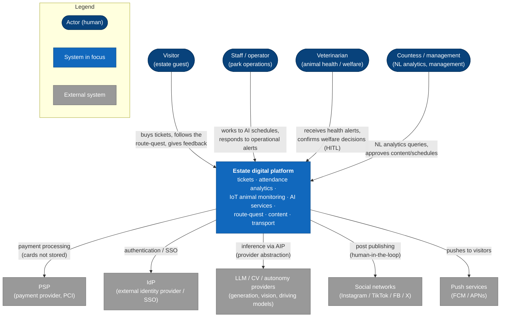

# C4 L1 — System Context (Von Digitalis Estates)

**What it shows:** the context of the whole estate platform — the actors who use it and the external systems it depends on.

The context of the whole estate platform: who uses it (actors) and which external systems it depends on. The single "system" here is the estate's digital platform (tickets, analytics, IoT animal monitoring, AI services).

## Legend

| Shape / color | Meaning |
|---|---|
| Oval (dark blue) | Actor — a human interacting with the system |
| Rectangle (blue) | System in focus — the estate digital platform |
| Rectangle (gray) | External system / provider (outside the team's area of responsibility) |
| Labeled arrow | Direction of interaction and its purpose |

## Description of elements and flows

**Actors** (correspond to the four stakeholder agents, see [ai-overview](../05-ai/ai-overview.md)):
- **Visitor** *(→ Visitor Agent)* — buys tickets (including family passes), takes the route-quest, leaves feedback, receives pushes/rewards.
- **Staff / operator** *(→ Operations Agent)* — works to AI schedules (shifts/feeding/maintenance), responds to operational alerts (queues, ride status, lost child).
- **Veterinarian** *(→ Animal Agent)* — responds to animal health alerts, confirms critical welfare decisions (human-in-the-loop): isolation, feeding changes, etc.
- **Countess / management** *(→ Management Agent)* — poses NL questions to analytics ("which zones are underused on Tuesday?"), approves content for social networks and schedules.

**External systems:**
- **PSP** — payment acceptance; the estate does not store card data (PCI isolation, external provider).
- **IdP** — identity/SSO for visitors and staff (build-vs-buy → buy).
- **LLM / CV / autonomy providers** — models for content generation, computer vision, and autonomous driving; access strictly via the AIP with provider abstraction and fallback.
- **Social networks** — target publishing platforms; posting after human-in-the-loop approval.
- **Push services (FCM/APNs)** — delivery of notifications to visitors' devices.
