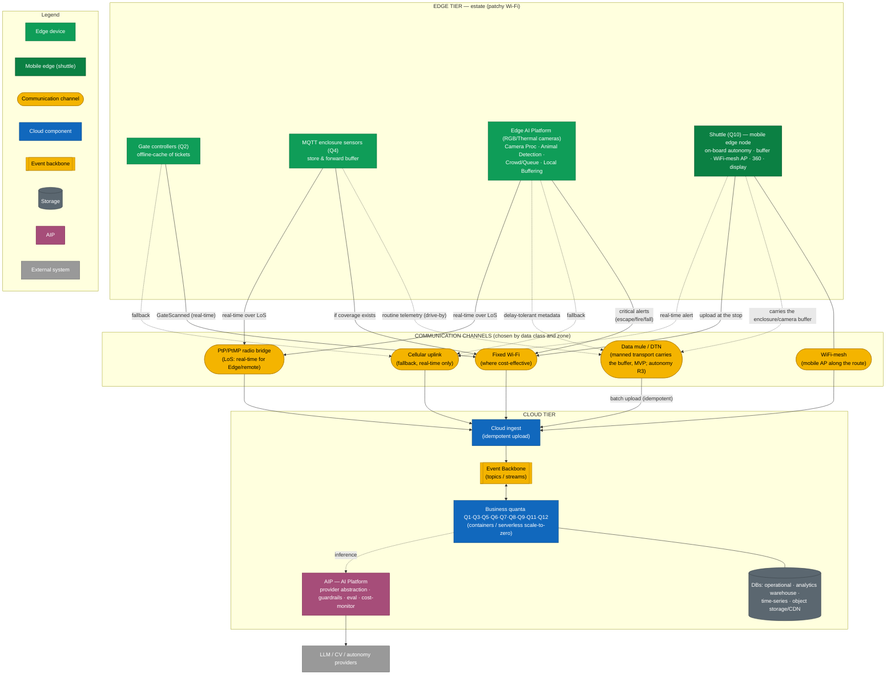

# Deployment — edge tiers → communication channels → cloud

**What it shows:** the physical placement and connectivity under patchy Wi-Fi — three edge tiers → heterogeneous channels → cloud + AIP.

Physical placement and **connectivity under patchy Wi-Fi**. Three tiers: edge devices in the estate → heterogeneous channels (Wi-Fi / mesh / data-mule / cellular) → cloud + AIP. Data is classified by delay tolerance: **real-time-critical** goes over a fixed/cellular channel, **delay-tolerant** — via the shuttle data mule.

> **Phases:** the diagram is the target architecture. In the **MVP** the channels = fixed Wi-Fi/mesh + **cellular uplink** (dual-carrier/satellite) + edge store-and-forward; **manned electric transport + data-mule — MVP** (they reduce the cost of connecting remote enclosures, not an MVP condition); shuttle **autonomy** — R3. See [mvp-vs-roadmap](../02-solution/mvp-vs-roadmap.md).

## Legend

| Shape / color | Meaning |
|---|---|
| Green rectangle | Edge device (stationary) in the estate |
| Dark-green rectangle | Mobile edge node (shuttle Q10) |
| Yellow oval | Communication channel |
| Blue rectangle | Cloud component (quanta, ingest) |
| Yellow block (double border) | Event backbone |
| Gray cylinder | Data storage |
| Purple rectangle | AIP |
| Solid arrow | Real-time / main flow |
| Dashed arrow | Delay-tolerant (data mule) or fallback |

## Description of tiers and channels

**EDGE TIER (estate, patchy Wi-Fi).** Gate controllers (Q2) with an offline ticket cache; MQTT enclosure sensors (Q4) with a store-and-forward buffer; fixed cameras with edge-CV compute boxes; the shuttle (Q10) as a mobile edge node (on-board autonomy, buffer, WiFi-mesh AP, 360 cameras, info-display). Only events/metadata leave outward — raw video and telemetry stay on the edge.

**Communication channels (hybrid, chosen by data class and zone):**
- **Fixed Wi-Fi** — where cost-effective; the primary channel for real-time.
- **WiFi-mesh** — a mobile AP on the shuttle patches coverage along the route.
- **Data mule / DTN** — the shuttle physically carries buffered delay-tolerant data from remote enclosures and uploads idempotently at a stop with connectivity (cheaper than a gateway at each of the 55 enclosures).
- **Cellular uplink** — fallback for real-time-critical events ("animal escaped," fire, purchase, child search) where there is no LoS/bridge.
- **Directional radio bridges (PtP/PtMP)** — a live channel for stationary Edge AI nodes and remote zones **with line-of-sight**; cheaper than cellular in operation, available already in the MVP. LoS/vegetation/weather/alignment risks and mitigations (site survey, backup/mesh, fiber for critical zones) — see [ADR-004](../04-adrs/ADR-004-edge-connectivity-mesh-cellular-data-mule.md), risk R21.

**Data classification:** real-time-critical → Wi-Fi/cellular (seconds); delay-tolerant (routine telemetry, drive-by snapshots, queue metrics) → data mule (minutes to tens of minutes).

**CLOUD TIER.** Cloud ingest (idempotent upload, at-least-once + dedup by event id) → event backbone → business quanta (containers/serverless scale-to-zero) with separated DBs (operational, analytics warehouse, time-series, object storage/CDN). The AIP serves inference for all AI quanta and reaches out to external LLM/CV/autonomy providers through the provider abstraction.
