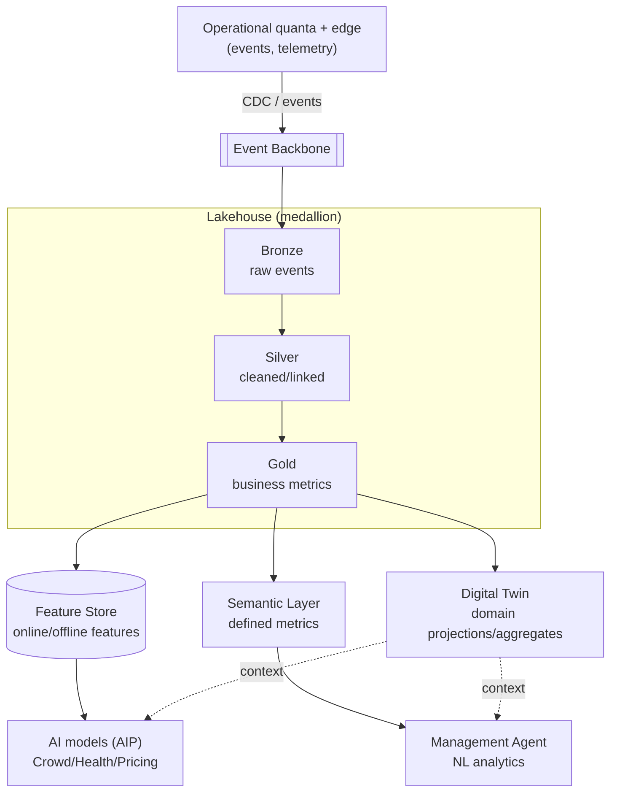

# Data flow — Data lifecycle (medallion → features/twin)

**What it shows:** how "raw material" (events) turns into cleaned data, business metrics, features, and a semantic layer — and feeds models and NL analytics. It illustrates the data platform as a whole (Lakehouse = memory + analytics + twin).

## Legend
Solid — transformation/flow · dashed — context · `[[...]]` — the bus · `(...)` — feature store.

## Key points
- Populated through **CDC/events over the bus**, without touching the quanta's operational autonomy (ADR-022 on top of database-per-quantum).
- **Gold** = business metrics → simultaneously features (models), Semantic Layer (NL analytics), and **Digital Twin** projections (a single context).
- Lineage + consent-for-training — at the lakehouse level (governance, ADR-018).
- The operational source-of-truth stays in the quanta; the lakehouse — the SoT for analytics/ML (ADR-024).
