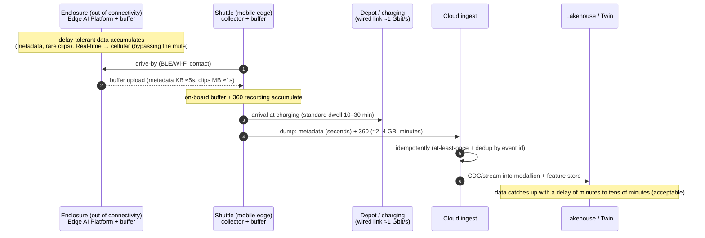

# Data flow — Data-mule (delay-tolerant under patchy Wi-Fi)

**What it shows:** how data from a remote enclosure (out of stable connectivity) reaches the cloud via the shuttle "mule" — pickup on drive-by, buffering, upload at charging. It illustrates operation under **patchy Wi-Fi** (brief constraint §E).

## Legend
Solid — synchronous exchange/upload · dashed (`-->>`) — response/data transfer · Note — principle/constraint.

## Key points
- **Real-time-critical does not ride the mule** — it goes over cellular/fixed channel (ADR-004/017).
- Pickup — seconds (metadata) to ≈sec (clips); the heavy 360 is dumped during **standard charging** (ADR-026).
- Idempotency guarantees no duplicates under at-least-once (ADR-007).
- For enclosures off the route — a separate utility mule cart (ADR-004).
