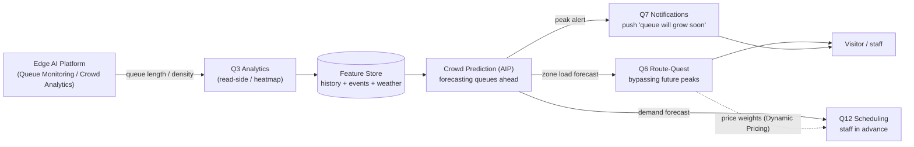

# Data flow — Data → Forecast → Action (Crowd Prediction)

**What it shows:** the predictive loop — from measuring queues to preemptive actions (route, staff, pushes). It illustrates that we do not just measure but **forecast and act**.

## Legend
Solid — data flow/signal · dashed — secondary link · `(...)` — storage/features.

## Key points
- The source is **fixed cameras (Queue Monitoring)**, not only app telemetry (ADR-011/020).
- The **forward** forecast (not measuring the fact) feeds three actions at once: route (Q6), schedule (Q12), notification (Q7).
- Mitigation of a self-fulfilling forecast — smoothing/soft distribution (ADR-020).
- The same demand forecast feeds Dynamic Pricing (ADR-021).
