# Data flow — Sensor → Decision loop (flagship)

**What it shows:** the full data path from sensor/camera to a decision and back — edge inference, the event bus, the AI domain, the lakehouse/twin, the agent, and **human-in-the-loop**. It illustrates "AI embedded in the business process end-to-end."

```mermaid
flowchart LR
    subgraph EDGE["EDGE (patchy Wi-Fi)"]
        cam["Edge AI Platform<br/>(camera/sensor → CV inference)"]
        buf["Local buffer<br/>store-and-forward"]
    end
    bb[["Event Backbone"]]
    q5["Q5 Animal Health & AI"]
    aip["AIP (model + eval + guardrails)"]
    lake[("Lakehouse + Feature Store<br/>= Digital Twin (projections)")]
    agent["Animal Agent"]
    keeper["Keeper / veterinarian"]
    q7["Q7 Notifications"]

    cam -->|"event/metadata<br/>(NOT raw video)"| buf
    buf -->|"real-time → fixed/cellular"| bb
    buf -.->|"delay-tolerant → data-mule"| bb
    bb --> q5
    q5 <-->|"inference/thresholds"| aip
    q5 -->|"HealthEvent + confidence"| bb
    bb --> lake
    agent -.->|"reads context (twin/memory)"| lake
    q5 -->|"high confidence → alert"| q7
    q7 --> keeper
    keeper -->|"confirms (human-in-the-loop)"| agent
    agent -->|"tool-call: action via quantum"| q5
    agent -.->|"writes outcome to memory"| lake
```

## Legend
Solid — main data flow/call · dashed — context/memory/delay-tolerant · `[[...]]` — event backbone · `(...)` — storage.

## Key points
- Only **events/metadata** leave the edge, the raw material stays (ADR-011).
- Real-time-critical goes immediately; routine — via the buffer/data-mule (ADR-003/004).
- An effectful decision — **only after human confirmation** (ADR-010); the agent acts through a typed tool (ADR-023) and writes the outcome to memory (ADR-024) → a closed loop.
