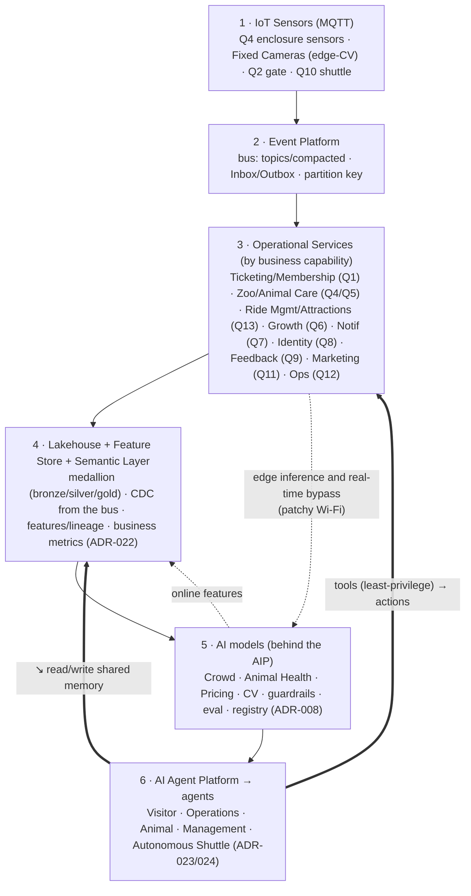
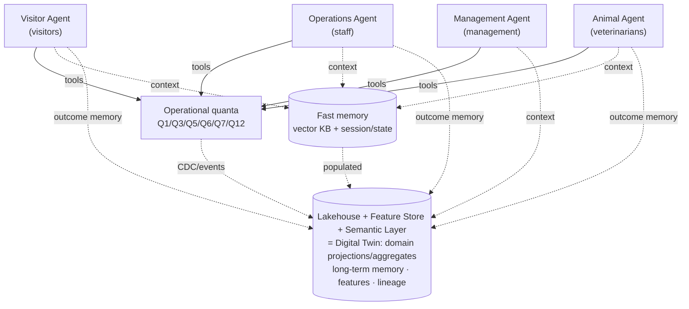

# Layered logical view (reference spine)

**What it shows:** a logical representation of the solution as a layered stack (IoT → bus → services → lakehouse → models → agents) on top of an event-driven edge architecture.

A logical representation of the solution as a layered stack. **This is a logical view** — physically the architecture is event-driven + edge (data also travels bypass routes: edge buffering, data mule, real-time bypass — see `deployment.md`, `reliability.md`), so strict linearity here is a convention.

## Agents by stakeholder + shared memory (enhanced view)

**The idea:** AI is embedded in business processes **by role** (visitors, staff, veterinarians, management), and the Lakehouse is a **shared memory and analytical layer**, not a separate warehouse with ML on the side. Working memory is a fast tier (ADR-024), operations go through tools into the quanta (ADR-023).

**Digital Twin** is a **projection**, not a separate component: a set of up-to-date domain projections/aggregates (gold + Semantic Layer) on top of the Lakehouse, giving agents a holistic picture of the park's state for decisions. We do not introduce a separate Twin layer/quantum.

## Legend / mapping
| Layer | Our components |
|---|---|
| 1 IoT Sensors (MQTT) | Q4, Fixed Cameras, Q2, Q10 (edge, store-and-forward, data mule) |
| 2 Event Platform | the event bus (Inbox/Outbox, compacted topics, partition key) |
| 3 Operational Services | Q1 Ticketing/Membership · Q4/Q5 Zoo & Animal Care · **Q13 Ride & Attractions Mgmt** · Q6, Q7, Q8, Q9, Q11, Q12 |
| 4 Lakehouse & Feature Store & **Semantic Layer** | ADR-022 (CDC on top of database-per-quantum) + business metrics for NL analytics |
| 5 AI models (behind the AIP) | Crowd/Animal/Pricing/CV — inference models (ADR-008) |
| 6 AI Agent Platform → agents | ADR-023/024 (Visitor/Operations/Animal/Management) + the physical shuttle (Q10) |

**Client channels:** Visitor Web/Mobile App (PWA) — visitors; **Staff Portal** — staff/veterinarians/management (host of the Operations/Animal/Management agents).

**Difference from a pure pipeline (our strength):** AI also runs on the edge (L5 ↔ L3), critical data bypasses the layers, and agents act through typed tools back into the operational services. This gives resilience to patchy Wi-Fi, which a linear stack does not provide.
