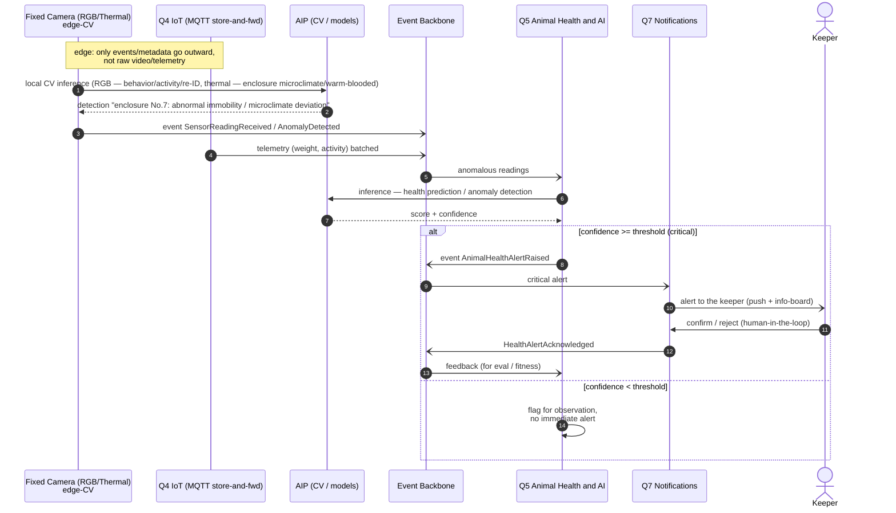

# Sequence — Animal health anomaly (health-alert)

**What it shows:** the flow of early detection of an animal health problem — from edge-CV detection to a critical alert to the keeper with human-in-the-loop confirmation.

The scenario of early detection of an animal health problem: **edge-CV / sensors** detect an anomaly → an event into the backbone → **Q5** runs inference → on high confidence a critical alert goes to **Q7 → the keeper**, who confirms (**human-in-the-loop**). Key characteristics: Accuracy, offline-tolerance, human validation of AI.

## Legend

| Element | Meaning |
|---|---|
| Rectangle | Sensor layer / quantum / AIP (participant) |
| Actor (human) | Keeper (human-in-the-loop) |
| Solid arrow `->>` | Synchronous call (inference / confirmation) |
| Dashed `-->>` | Response |
| Arrow `-)` | Asynchronous event via the backbone / push |
| Block `alt / else` | Branching by the AI confidence threshold |
| Note | Architectural principle (edge processing) |

## Flow description

1. The fixed camera (RGB/thermal) performs CV inference **on the edge** — only metadata leaves outward ("enclosure No.7: abnormal activity / microclimate deviation"), not raw video. For **cold-blooded venomous** animals, detection/counting/escape — via RGB-CV + breach sensors/RFID (thermal cannot see them; thermal — for warm-blooded/fire/intruders, climate — on MQTT sensors, see ADR-011).
2. The camera and Q4 (MQTT) publish events/telemetry to the backbone (Q4 — in batches, store-and-forward under patchy Wi-Fi).
3. Q5 receives the anomalous readings and runs inference via the AIP (health prediction, anomaly detection), obtaining score + confidence.
4. **If confidence is above the threshold** (critical) — Q5 raises `AnimalHealthAlertRaised`; Q7 delivers the alert to the keeper (push + info-board).
5. The keeper confirms or rejects — **human-in-the-loop** validation of the AI result (a kata requirement). The confirmation is returned as feedback for the eval/fitness functions.
6. **If confidence is below the threshold** — it is flagged for observation without an immediate alert (fighting false positives).
