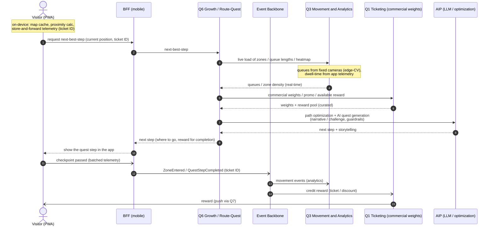

# Sequence — Route-quest step

**What it shows:** the flow of one step of the dynamic route-quest — requesting next-best-step from Q6 and optimizing the path across 3 goals with queue data and commercial weights.

The scenario of one step of the dynamic route-quest: the app requests **next-best-step** from **Q6**, which optimizes the path across 3 goals (minimum queues × maximum experience × commercial benefit). Queue/heatmap data comes from **Q3**, commercial weights and the reward — via **Q1**. Inference/generation — via the AIP.

## Legend

| Element | Meaning |
|---|---|
| Actor (human) | Visitor via PWA |
| Rectangle | Quantum / BFF / AIP (participant) |
| Solid arrow `->>` | Synchronous call (REST) |
| Dashed `-->>` | Synchronous response |
| Arrow `-)` | Asynchronous event / reward via the backbone |
| Note | Architectural context (on-device, data sources) |

## Flow description

1. The app (PWA) computes much **on-device** (map cache, proximity, store-and-forward of telemetry under a pseudonymous ticket ID) and requests next-best-step from the BFF.
2. The BFF calls **Q6** (the route-quest optimization engine).
3. Q6 takes the live load of zones and queue lengths from **Q3** (queues — from fixed-camera edge-CV; dwell-time — from app telemetry by ticket ID).
4. Q6 requests from **Q1** the commercial weights, promo, and the available (curated) reward.
5. Q6 optimizes the path across 3 goals via the **AIP** and generates the quest narrative/challenge (with guardrails).
6. The next step with the reward is returned to the app.
7. Passing a checkpoint goes in batches as events (`ZoneEntered` / `QuestStepCompleted`) into the backbone → to Q3 (analytics) and Q1 (reward crediting — ticket/discount, push via Q7).
