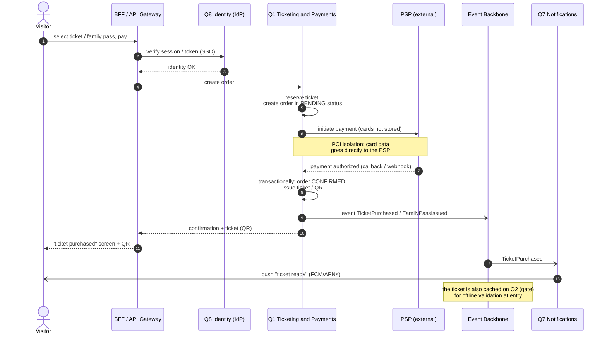

# Sequence — Ticket purchase

**What it shows:** the ticket sale flow (including a family pass) — from selection and SSO to transactional confirmation via an external PSP and QR issuance.

The ticket-sale scenario (including a family pass). Key characteristics of Q1: **Security (PCI)** and **transactional consistency** — the only place with strong consistency. The estate does not store card data: payment is processed by an external PSP.

## Legend

| Element | Meaning |
|---|---|
| Actor (human) | Visitor |
| Rectangle | Quantum / external system (participant) |
| Solid arrow `->>` | Synchronous call (REST) |
| Dashed arrow `-->>` | Synchronous response |
| Arrow `-)` | Asynchronous event (into the backbone / push) |
| Note | Architectural clarification (PCI, offline) |

## Flow description

1. The visitor selects a ticket and pays via the BFF.
2. The BFF verifies identity via Q8 (external IdP / SSO).
3. Q1 creates an order in PENDING status and reserves the ticket.
4. Q1 initiates payment in the **PSP** — card data goes directly to the PSP (PCI isolation), the estate does not store it.
5. After payment authorization Q1 **transactionally** moves the order to CONFIRMED and issues the ticket/QR (strong consistency is exactly here).
6. Q1 publishes the `TicketPurchased` / `FamilyPassIssued` event to the backbone.
7. The BFF returns the confirmation and QR to the visitor.
8. Q7 sends a push on the event; the ticket is also cached on Q2 (gate) for offline validation at entry under patchy Wi-Fi.
